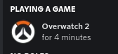
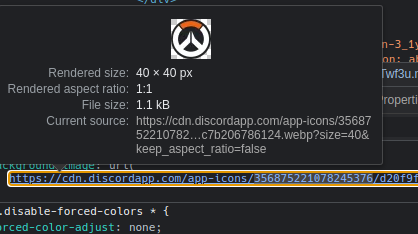

### Overwatch 2 Discord RPC

Discord Rich Presence for Overwatch 2 in Linux. Let your friends know you play Overwatch 2 or any other games (with some tweaking).



Make sure you already installed Pypresence:

```sh
pip install pypresence
```

This script supposed to work with some hook when you launch the game.

I personally use BPSWM's external rules to run the script when Overwatch.exe is launched

```sh
python3 path/to/rich-presence.py > /dev/null 2>&1 &
```

#### For non-Overwatch 2 game

To get any other games `client_id`, open dev tool then copy the id part of image url



`client_id` should appear next to `.../app-icons/`.
